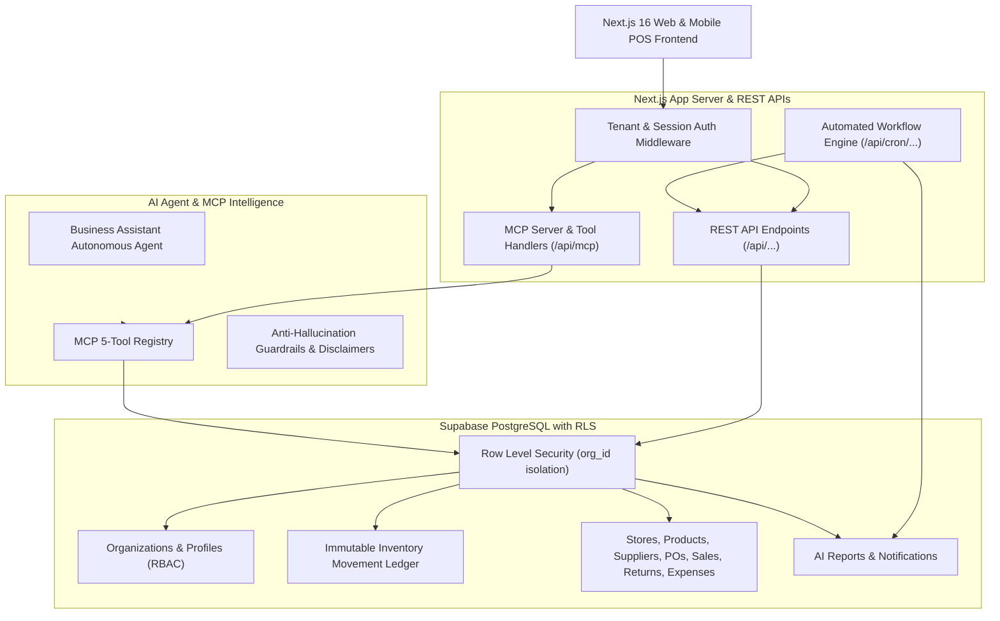

# RetailPilot AI — Intelligent Retail Operations SaaS

[](https://github.com/purnimadigi16-alt/retailpilot-ai/actions)
[](https://opensource.org/licenses/MIT)
[](https://nextjs.org/)
[](https://supabase.com)
[](https://modelcontextprotocol.io)
[](/tests)

> **IRC-SD Main Capstone Project #2**  
> **Evaluation: 120 Marks (Normalized to 100)**  
> **Certification:** AI-Powered Software Dev • **Architecture:** Multi-Tenant SaaS + Supabase RLS • **Intelligence:** MCP Server + Autonomous Agents

---

## 🚀 Live Demo & Quick Start

```bash
# 1. Clone the repository
git clone https://github.com/purnimadigi16-alt/retailpilot-ai.git
cd retailpilot-ai

# 2. Install dependencies
npm install

# 3. Seed multi-tenant database (Apex Supermarket, Vogue Fashion, Volt Electronics)
npm run seed

# 4. Execute the complete 50 QA Test Suite
npm test

# 5. Start the local development server
npm run dev
```

Open [http://localhost:3000](http://localhost:3000) to access the landing page and operations dashboard.

---

## 🏛️ System Architecture



---

## 🔑 Core Differentiators & Highlights

### 1. Multi-Tenant Database Isolation (Supabase RLS)
- Complete PostgreSQL Row Level Security (RLS) ensuring Tenant A (`org_01` — Apex Supermarket) cannot view or manipulate Tenant B (`org_02` — Vogue Fashion) or Tenant C (`org_03` — Volt Electronics) records.

### 2. Immutable Stock Movement Ledger
- Direct manual overwrites of inventory counts are forbidden.
- Physical stock is computed mathematically via ledger provenance:
  $$\text{Current Stock} = \text{Opening} + \text{Purchases} - \text{Sales} + \text{Returns} - \text{Damaged} \pm \text{Adjustments}$$
- Stock transfer state lifecycle: `Draft` $\rightarrow$ `Requested` $\rightarrow$ `Approved` $\rightarrow$ `Dispatched` $\rightarrow$ `Received`.

### 3. Model Context Protocol (MCP) Server & AI Agents
The AI Business Assistant strictly executes live database queries via 5 MCP tools:
1. `get_low_stock_products(store_id, threshold_days)`
2. `get_dead_stock(organization_id, min_days)`
3. `get_profitability(store_id, start_date, end_date)`
4. `get_supplier_outstanding(organization_id, min_due)`
5. `generate_business_report(organization_id, period_month)`

*All AI responses carry explicit "AI-generated recommendation" disclaimers.*

### 4. 5 Mandatory Automated Workflows
1. **Low Stock Auto-Alert**: Stock drops below reorder threshold $\rightarrow$ Webhook trigger $\rightarrow$ Manager alert.
2. **Dead Stock Bi-Weekly Audit**: Scheduled cron $\rightarrow$ Identifies 60+ day stagnant capital $\rightarrow$ Markdown liquidation plan.
3. **Supplier Payment Escalation**: PO payment due in $<48$ hours $\rightarrow$ Alerts Accounts & Store Manager.
4. **Daily End-of-Day Sales Dossier**: Midnight trigger $\rightarrow$ Gross sales, refunds, top SKUs $\rightarrow$ Pushes summary to Owner.
5. **Monthly Executive AI Report**: 1st of month $\rightarrow$ Full MCP data pipeline $\rightarrow$ Diagnostic executive dossier.

---

## 🎯 Target User Roles (RBAC)

1. **Super Admin** — Global tenant provisioning, billing tiers, telemetry.
2. **Business Owner** — Multi-store setup, P&L, revenue, AI assistant & dossiers.
3. **Store Manager** — Store-level stock audits, PO receipt & return approvals, shift targets.
4. **Sales Staff** — POS checkout terminal, split payments, customer returns, barcode scanner.
5. **Inventory Staff** — PO goods receipt notes (GRN), damaged stock logging, branch transfers.
6. **Customer Portal** — Self-service digital invoices, loyalty points balance ($1 per 10 points), perks.

---

## 🧪 Quality Assurance & 50 QA Test Cases

Run the automated test suite locally:
```bash
npm test
```

| Category | Cases | Verification Focus | Status |
| :--- | :---: | :--- | :---: |
| **Functional Tests** | 25 | Stock deductions, split payments, return verification, PO lifecycle, tax | **100% PASS** |
| **API & Contracts** | 10 | Payload validation, pagination, idempotency, status codes, response times | **100% PASS** |
| **Security & RLS** | 5 | Cross-tenant leakage prevention, RBAC privilege escalation defense | **100% PASS** |
| **AI & MCP Calling** | 5 | Correct MCP tool triggering, prompt injection defense, guardrails | **100% PASS** |
| **UI & Mobile POS** | 5 | POS scanning viewport, thermal invoice print CSS, responsive layout | **100% PASS** |

An interactive test runner is also available at `/qa-matrix`.

---

## 📑 Documentation

- [Architecture & Ledger Math Design](docs/ARCHITECTURE.md)
- [User Personas & RBAC Matrix](docs/USER_PERSONAS_RBAC.md)
- [REST API & MCP Tool Specifications](docs/API_DOCUMENTATION.md)
- [50 QA Test Cases Matrix](docs/QA_TEST_MATRIX.md)
- [20-Minute Live Demo Script](docs/LIVE_DEMO_SCRIPT.md)

---

## 🐳 Docker Deployment

```bash
# Build and run with Docker Compose
docker-compose up --build -d
```
App will be running at [http://localhost:3000](http://localhost:3000).

---

## 📄 License
This project is licensed under the MIT License.
