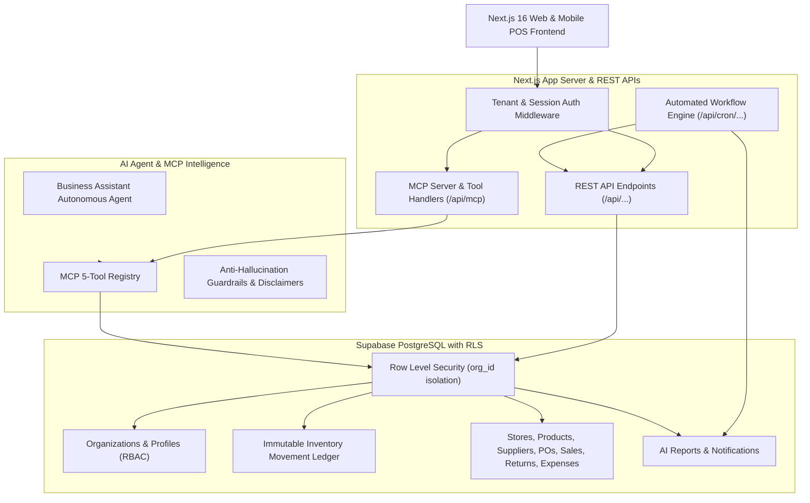
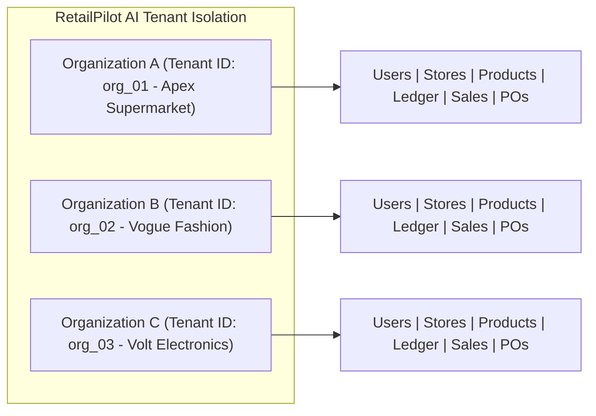

# RetailPilot AI — Architecture & System Design Document

## 1. System Overview

**RetailPilot AI** is a production-grade, multi-tenant retail operations, POS, and autonomous business intelligence SaaS. It supports supermarkets, fashion boutiques, consumer electronics, department stores, and general merchandise retailers with strictly isolated multi-tenant operations, an immutable stock movement ledger, and live Model Context Protocol (MCP) tool intelligence.

---

## 2. Multi-Tenant Architecture & Data Isolation

Data isolation is strictly enforced at the database level using **Supabase Row-Level Security (RLS)** in PostgreSQL:

- **Tenant Scope (`organization_id`)**: Every operational table (`stores`, `products`, `inventory_ledger`, `suppliers`, `purchases`, `sales`, `returns`, `expenses`, `notifications`, `ai_reports`) contains an `organization_id` foreign key.
- **RLS Enforcement**:
  - Tenant A (`org_01` — Apex Supermarket) can never read or modify Tenant B (`org_02` — Vogue Fashion) data.
  - User profiles link directly to `organization_id`.
  - Super Admin role possesses elevated global scoping for tenant provisioning and telemetry.

---

## 3. Immutable Stock Movement Ledger

Direct manual overwrites of product inventory counts are forbidden. Physical stock balances are calculated mathematically from an immutable ledger:

$$\text{Current Stock} = \text{Opening Stock} + \text{Purchases} - \text{Sales} + \text{Returns} - \text{Damaged} \pm \text{Adjustments}$$

### Movement Types:
- `OPENING_STOCK`: Initial stock intake when store opens.
- `PURCHASE`: Positive intake when a Purchase Order (PO) transitions to `Received` (Goods Receipt Note - GRN).
- `SALE`: Signed negative deduction triggered upon POS sale checkout.
- `RETURN`: Signed positive credit triggered upon customer refund/return authorization.
- `DAMAGED`: Negative quantity deduction for transit loss, spoilage, or broken goods.
- `ADJUSTMENT`: Signed reconciliation delta from physical inventory audits.
- `TRANSFER_IN` / `TRANSFER_OUT`: Inter-branch inventory relocations.

### Stock Transfer State Machine:
$$\text{Draft} \longrightarrow \text{Requested} \longrightarrow \text{Approved} \longrightarrow \text{Dispatched} \longrightarrow \text{Received}$$

---

## 4. Model Context Protocol (MCP) Architecture

RetailPilot AI exposes a standard MCP server implementation (JSON-RPC 2.0) with 5 live database tools:

1. `get_low_stock_products(store_id, threshold_days)`: Identifies SKUs where current stock $\le$ reorder threshold, computes historical sales velocity, and estimates runout days.
2. `get_dead_stock(organization_id, min_days)`: Queries SKUs with zero recorded sales in 60+ days and computes stagnant tied-up capital.
3. `get_profitability(store_id, start_date, end_date)`: Computes $\text{Gross Sales} - \text{COGS} - \text{Operating Expenses} = \text{Net Profit}$.
4. `get_supplier_outstanding(organization_id, min_due)`: Aggregates accounts payable, credit terms, and overdue balances.
5. `generate_business_report(organization_id, period_month)`: Compiles structured JSON diagnostic dossier combining revenue, margins, dead capital, and AI strategic directives.

> [!IMPORTANT]
> **Anti-Hallucination Guarantee**: AI Business Assistant responses are strictly derived from live MCP database executions and conclude with the mandatory disclaimer:
> *"AI-generated recommendation — please verify all figures before commercial execution."*
